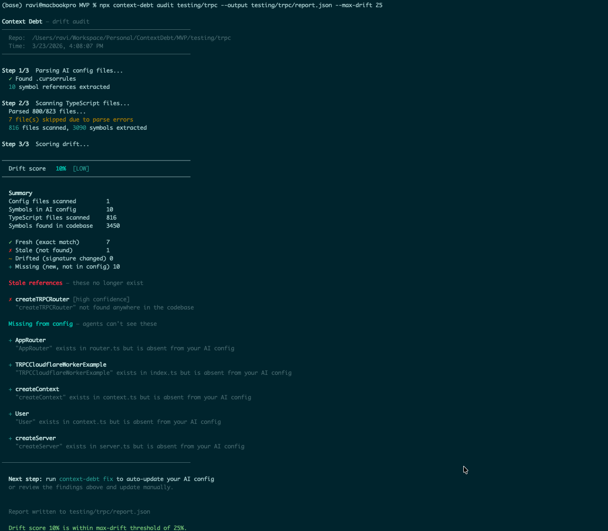

# Context Debt

> Early alpha — expect rough edges. Stars and issues welcome.

[](./LICENSE)
[](package.json)

**Your AI agents are working from a lie.** Every time you rename a function, refactor a class, or add a new module — your `CLAUDE.md`, `.cursorrules`, or Copilot instructions fall further out of sync with reality. The AI keeps confidently using the old names. This is **context drift**, and it gets worse every day you don't fix it.

Context Debt parses your TypeScript AST and compares it against your AI config files. It produces a **drift score** (0–100%) and a precise list of what's stale, what's changed signature, and what the AI is missing entirely — so you can fix it before it costs you.



## Installation

Requires **Node.js 18+**.

```bash
npm install @context-debt/core
```

Or run directly without installing:

```bash
npx @context-debt/core audit /path/to/your/repo
```

## Usage

### CLI

```bash
# Audit the current directory
npx context-debt audit .

# Audit a specific repo
npx context-debt audit /path/to/typescript-repo

# Write a JSON report to disk (for history tracking)
npx context-debt audit . --output .context-debt/report.json

# Fail with exit code 1 if drift exceeds a threshold (for CI)
npx context-debt audit . --max-drift 25

# Both together
npx context-debt audit . --output .context-debt/report.json --max-drift 25
```

### Tracking drift over time

Commit `.context-debt/report.json` alongside your code. Each run overwrites it with the latest report, so you can diff it in PRs to see exactly what drifted:

```bash
# In your git diff you'll see:
-  "driftScore": 12,
+  "driftScore": 34,
```

Add `.context-debt/report.json` to version control but add the directory to `.gitignore` exceptions:

```gitignore
# Track the drift report in git
!.context-debt/report.json
```

### CI — fail PRs above a drift threshold

Create `.github/workflows/context-debt.yml` in your repo:

```yaml
name: Context Debt

on:
  push:
    branches: [main]
  pull_request:

jobs:
  drift:
    runs-on: ubuntu-latest
    steps:
      - uses: actions/checkout@v4

      - uses: actions/setup-node@v4
        with:
          node-version: 20

      - name: Run drift audit
        run: npx @context-debt/core audit . --output .context-debt/report.json --max-drift 25

      - name: Upload drift report
        if: always()
        uses: actions/upload-artifact@v4
        with:
          name: drift-report
          path: .context-debt/report.json
```

This will:
- Run on every push to `main` and every PR
- Write the JSON report as a CI artifact (downloadable from the Actions tab)
- Exit non-zero and **fail the PR** if drift exceeds 25%

### SDK

```js
const { RepoIndex } = require('@context-debt/core');

const index = new RepoIndex({ repoPath: '/path/to/repo' });

// Run a full drift audit
const report = await index.audit();
console.log(report.driftScore);   // e.g. 34
console.log(report.severity);     // 'clean' | 'low' | 'degraded' | 'high' | 'critical'
console.log(report.findings.stale);    // symbols that no longer exist
console.log(report.findings.drifted);  // symbols whose signatures changed
console.log(report.findings.missing);  // exported symbols absent from your AI config

// Get a compressed, freshness-guaranteed context slice for a specific task
const context = await index.getContext({ task: 'Refactor the auth module' });
console.log(context.skeleton);         // TypeScript skeleton ready to inject into an agent
console.log(context.tokenEstimate);    // Rough token count

// Get all symbols from a specific file
const symbols = await index.getFileSymbols('./src/auth.ts');
console.log(symbols.functions);
console.log(symbols.classes);

// Force a re-scan (clears in-memory cache)
await index.refresh();
```

## How it works

```
cli.js
  └── config-parser.js   reads .cursorrules / CLAUDE.md / copilot-instructions.md
  └── scanner.js         walks the repo, finds all .ts/.tsx files
        └── extractor.js  parses each file with tree-sitter, extracts symbols
  └── scorer.js          compares claimed vs actual → DriftReport

index.js                 public SDK wrapper (RepoIndex class)
```

**Data flow:**

1. `config-parser.js` reads your AI config files and extracts every symbol reference — function calls, class names, type annotations, backtick spans
2. `scanner.js` walks the repo and calls `extractor.js` per file to get the live AST snapshot
3. `scorer.js` compares the two and assigns each claimed symbol a state:
   - **FRESH** — symbol exists with a matching signature
   - **DRIFTED** — symbol exists but its signature changed
   - **STALE** — symbol not found anywhere in the codebase
   - **MISSING** — exported symbol exists in the codebase but is absent from all AI configs
4. A drift score (0–100%) is computed as `(stale + drifted) / total claimed`

## Drift score severity bands

| Score | Severity | Meaning |
|---|---|---|
| 0% | clean | All claimed symbols are fresh |
| 1–15% | low | Minor drift — acceptable |
| 16–35% | degraded | Noticeable drift — worth fixing |
| 36–60% | high | Significant drift — agents will make mistakes |
| 61–100% | critical | Severe drift — AI context is unreliable |

## Supported AI config files

| File | Tool |
|---|---|
| `CLAUDE.md` | Claude Code |
| `.cursorrules` | Cursor |
| `.github/copilot-instructions.md` | GitHub Copilot |
| `copilot-instructions.md` | GitHub Copilot |
| `AGENTS.md` | General |
| `AI_CONTEXT.md` | General |
| `.ai-context` | General |

## DriftReport shape

```ts
interface DriftReport {
  driftScore: number;          // 0–100
  severity: 'clean' | 'low' | 'degraded' | 'high' | 'critical';
  summary: {
    totalClaimed: number;
    fresh: number;
    stale: number;
    drifted: number;
    missing: number;
    filesScanned: number;
    totalSymbolsFound: number;
  };
  findings: {
    stale:   Finding[];
    drifted: Finding[];
    missing: Finding[];
    fresh:   Finding[];
  };
  generatedAt: string;
}
```

## ContextSlice shape (from `getContext()`)

```ts
interface ContextSlice {
  task: string;
  symbolCount: number;
  skeleton: string;        // TypeScript skeleton to inject into your agent
  symbols: Symbol[];       // Structured symbol data
  freshAt: string;
  tokenEstimate: number;   // Rough token count (skeleton.length / 4)
}
```

## Design principles

**Deterministic, not probabilistic.** Drift detection uses AST parsing — if `UserService.createUser` was renamed to `AuthService.registerUser`, the AST knows this with certainty. There are no LLMs in the core pipeline.

**Local-first.** All parsing happens on your machine. No source code is sent to any external API.

**Precision over recall.** A false positive destroys trust immediately. The config parser errs toward precision (~90%) over recall (~80%). Each finding carries a `confidence` field (`high` / `medium` / `low`) — the CLI shows only `high` and `medium` by default.

## Current limitations

- **TypeScript only.** Python and Go support is planned (tree-sitter grammars exist for both).
- **No disk caching.** AST results are cached in memory per `RepoIndex` instance. Large repos (2000+ files) re-scan on every run.
- **Monorepo path aliases not resolved.** `tsconfig.json` path aliases (e.g. `@/components/...`) are not yet resolved. Barrel re-exports may cause symbol duplication.
- **Config parser is heuristic.** Regex on free-form text — treat it as ~80% recall, ~90% precision.
- **Relevance scoring is keyword overlap.** `getContext()` scores relevance by matching task description tokens against symbol names. Works well for explicit task descriptions; naive for vague ones. Embeddings in v2.

## Roadmap

1. Test on large public repos (tRPC, Prisma, create-t3-app)
2. Monorepo path alias resolution (parse `tsconfig.json` `paths`)
3. Barrel file re-export deduplication
4. Disk caching (write to `.context-debt/cache/`)
5. Python support
6. MCP server wrapper (`audit_drift` and `get_repo_context` as MCP tools)

## Dependencies

- [`tree-sitter`](https://github.com/tree-sitter/tree-sitter) — C-based parser framework with Node.js bindings
- [`tree-sitter-typescript`](https://github.com/tree-sitter/tree-sitter-typescript) — TypeScript grammar for tree-sitter

No other runtime dependencies.

## License

MIT
